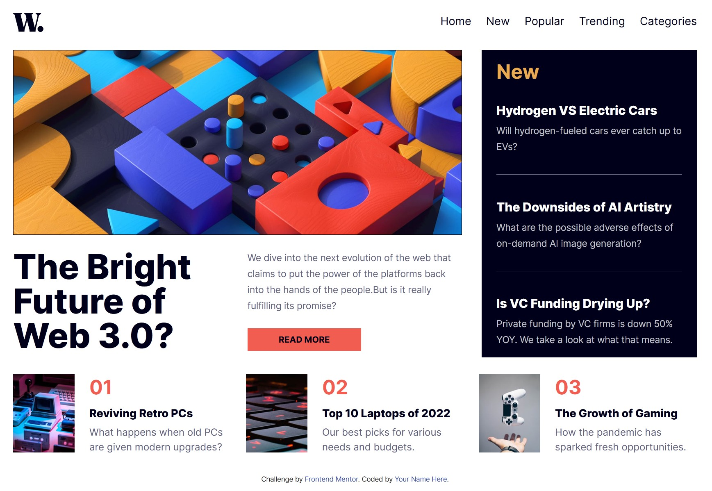

# Frontend Mentor - News homepage solution

This is a solution to the [News homepage challenge on Frontend Mentor](https://www.frontendmentor.io/challenges/news-homepage-H6SWTa1MFl). It uses HTML, SCSS, and vanilla JavaScript to build a responsive news layout with a mobile navigation panel.

## Table of contents

- [Overview](#overview)
  - [The challenge](#the-challenge)
  - [Screenshot](#screenshot)
  - [Links](#links)
- [Getting started](#getting-started)
- [My process](#my-process)
  - [Built with](#built-with)
  - [What I learned](#what-i-learned)
  - [Continued development](#continued-development)
  - [Useful resources](#useful-resources)
  - [AI collaboration](#ai-collaboration)
- [Author](#author)
- [Acknowledgments](#acknowledgments)

## Overview

### The challenge

The challenge is to create a news homepage that adapts to different screen sizes and provides clear hover and keyboard focus states for interactive elements.

The implementation includes a hero story with responsive imagery, a latest-news panel, numbered featured articles, and a navigation panel for mobile and tablet screens. Desktop navigation starts at 1024px. Article and category destinations remain placeholders.

### Screenshot



### Links
- Solution URL: [Repository](https://github.com/jonghwascript/news-homepage)
- Live Site URL: [Live site](https://jonghwascript.github.io/news-homepage)

## Getting started

Install Node.js and npm, then install the project dependencies:

```sh
npm install
```

Build the site:

```sh
npm run build
```

Open `dist/index.html` in a browser, or serve the `dist` directory with a local static server.

For development:

```sh
npm run dev
```

This performs an initial build and watches HTML, SCSS, and static assets. It does not start an HTTP server or provide automatic browser reloads. Refresh the browser after changes.

| Command | Purpose |
| --- | --- |
| `npm run build` | Clean `dist`, compile SCSS with source maps, process HTML, and copy assets |
| `npm run dev` | Build and watch source files |
| `npm run format` | Format source HTML, SCSS, JavaScript, and the Gulp file |

Edit files in `src`; generated files in `dist` are replaced during builds. There is no automated test suite configured: `npm test` currently reports that no test is specified and exits with an error.

## My process

### Built with

- Semantic HTML, heading hierarchies, and landmark elements
- SCSS modules, shared variables, and breakpoint mixins
- CSS Grid, Flexbox, custom properties, and CSS counters
- A mobile-first layout with `clamp()` and `minmax()`
- Responsive images using `picture` and `source`
- Vanilla JavaScript for navigation state and focus restoration
- Gulp for HTML processing, Sass compilation, asset copying, and file watching

### What I learned

#### Expressing the layout with Grid and Flexbox

The page uses one column on smaller screens and named grid areas on desktop. The hero and latest-news sections sit next to each other, while featured articles span the row below. Flexbox handles navigation links and article content.

```scss
@include mq('desktop') {
  grid-template-columns:
    minmax(clamp(35rem, 8.846rem + 40.865vw, 45.625rem), 1fr) 1fr;
  grid-template-areas:
    "hero latest"
    "hero latest"
    "featured featured";
}
```

Named areas make the intended arrangement readable. Fluid sizing still needs testing with enlarged text and constrained widths; a desktop breakpoint alone does not guarantee that content will fit.

#### Selecting elements and registering handlers correctly

`getElementsByClassName()` returns a collection, while `querySelector()` selects a single element. Selecting the same button for both opening and closing also caused the second `onclick` assignment to replace the first.

The final script selects each button separately and is loaded at the end of the body, after the elements exist:

```js
const $button = document.querySelector('.nav-toggle');
const $close = document.querySelector('.news-nav button.close');

$button.onclick = () => {
  $button.setAttribute('aria-expanded', 'true');
};

$close.onclick = () => {
  $button.setAttribute('aria-expanded', 'false');
  $button.focus();
};
```

#### Keeping responsive styling and menu state in sync

CSS uses `:has()` to reveal navigation when the button has `aria-expanded="true"`. The expanded panel styles apply only below 1024px. JavaScript uses `matchMedia()` to reset the attribute when entering the desktop layout and checks the initial viewport too.

```js
const desktop = window.matchMedia('(min-width: 1024px)');

function resetMenu() {
  if (desktop.matches) {
    $button.setAttribute('aria-expanded', 'false');
  }
}

desktop.addEventListener('change', resetMenu);
resetMenu();
```

The mobile panel uses `position: fixed`, `height: 100dvh`, and `overflow-y: auto`. Translating a panel outside the viewport does not prevent its links from receiving keyboard focus, so the closed panel also uses `visibility: hidden`. Visibility is restored when it opens and in the desktop layout.

#### Making accessibility part of implementation

Article links stay inside their `h3` headings. The logo has an accessible name, decorative button icons use `aria-hidden="true"`, and the Read More link includes visually hidden text naming the article. Closing navigation restores focus to its trigger.

The menu also respects the user's reduced-motion preference:

```scss
@media (prefers-reduced-motion: reduce) {
  transition: none;
}
```

These changes address specific issues; they do not establish full accessibility compliance. Outstanding checks are listed under Continued development.

#### Keeping generated output separate from source

Early changes made only in `dist/index.html` were not present in the source template. Moving the script reference and article links into `src/pages/index.html` ensures that subsequent builds preserve them.

### Continued development

- Add the actual skip-to-content link. Its styles and the `main` target already exist, but the link is not yet in the HTML.
- Replace placeholder article and navigation destinations with real URLs or section targets.
- Improve the red text used for navigation focus and featured-article hover/focus states. Its contrast against white is approximately 3.27:1, below the 4.5:1 target for normal-sized text.
- Add a non-color cue, such as an underline, to links within footer text.
- Verify keyboard navigation, 200% text enlargement, narrow and landscape screens, touch targets, high-contrast mode, and screen-reader behavior in a browser.
- Review image alternatives according to whether each image conveys information or duplicates nearby content.

JavaScript syntax checks and in-memory Sass compilation passed during development reviews. Browser interaction and screen-reader testing have not yet been completed. Background scroll locking is not currently implemented.

### Useful resources

- [Gulp notes](./doc/gulp.md) - Additional project notes about the build tooling.

### AI collaboration

I used OpenAI Codex to investigate click-handler problems, discuss responsive layout options, review the source against the accessibility checklist, and document implementation decisions.

Comparing suggestions against the actual source helped identify issues such as changes existing only in generated output and hidden navigation remaining keyboard-focusable. Reviews also caught a desktop regression after adding `visibility: hidden` to the mobile panel. The resulting documentation separates verified source changes from browser checks that still need to be performed.

## Author

- Frontend Mentor - [@jonghwascript](https://www.frontendmentor.io/profile/jonghwascript)
- GitHub - [@jonghwascript](https://github.com/jonghwascript)

## Acknowledgments

Thanks to Frontend Mentor for the challenge design and assets. The accessibility review used a checklist based on The A11Y Project, and the shared layout utilities include patterns credited to Every Layout.
